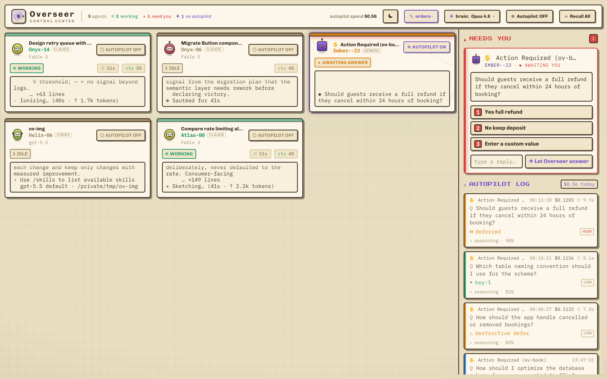
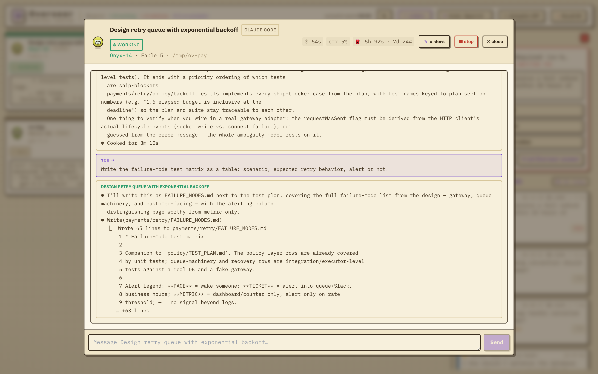
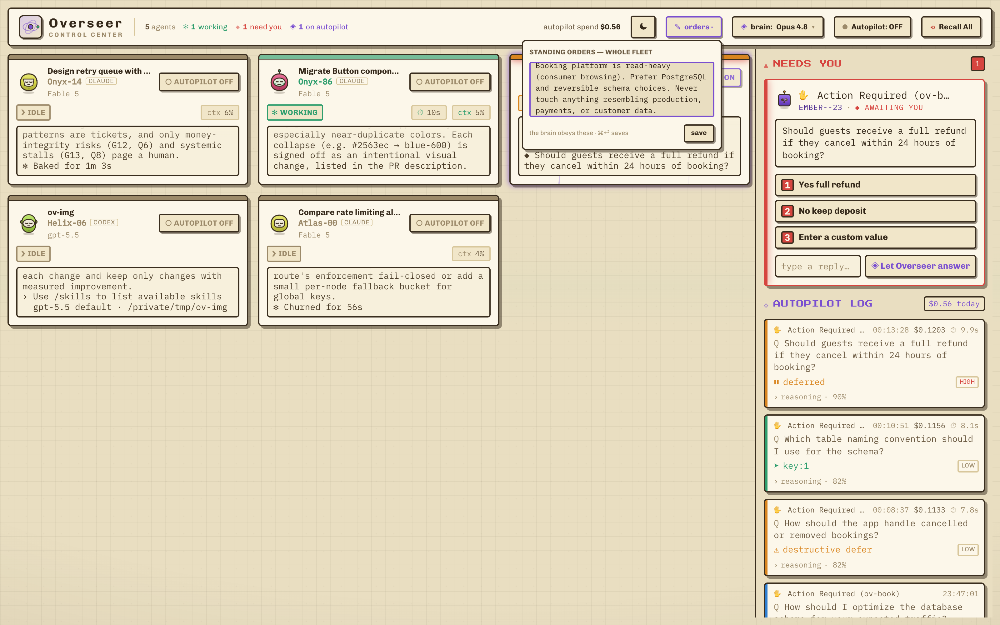
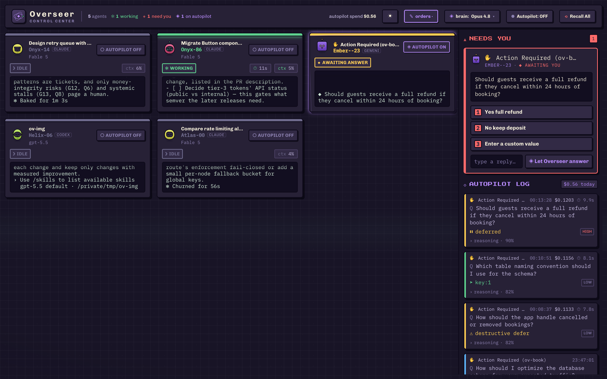
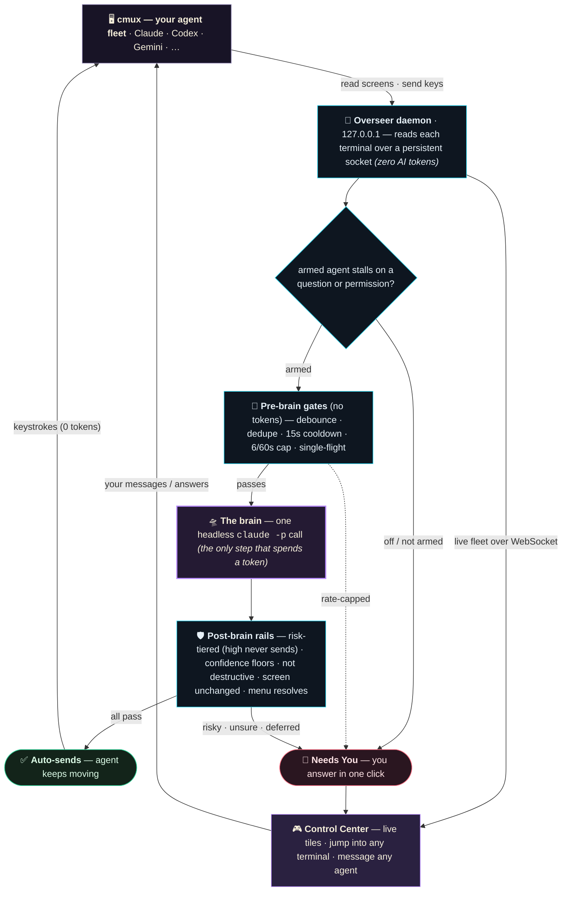

<div align="center">



# ☉ Overseer

### One screen to **watch, command, and auto-pilot** your whole fleet of AI coding agents.

[](#-status)
[](#-privacy--safety)
[](#-does-it-cost-tokens)
[](#-agent-agnostic-by-design)
[](LICENSE)

*A retro-game mission deck for [cmux](https://cmux.com). Type `overseer`, and every other agent in
your terminal becomes a live tile you can peek into, message, or hand to an AI that answers the
**judgment-call questions** your auto modes still stop to ask you.*

<br/>



<sub>**A live mixed fleet** — Claude, Codex, and Gemini agents in one view, each tagged by type. Anything the brain shouldn't decide alone lands in **Needs You**; every call it does make is recorded in the **Autopilot Log** with its risk, cost, and reasoning.</sub>

</div>

---

## ⚡ The 30-second version

You're running a swarm of coding agents — Claude Code in one cmux tab, Codex in another, Gemini in a
third, all in auto mode. Auto mode is great: it approves their tool calls, grants permissions, and
recovers from most blocks on its own. But there's **one pause it can't clear** — the moment an agent
stops to ask *you* a genuine judgment question:

> *"I found two valid migration paths — which did you mean?"*

No auto mode auto-answers an agent's **own** clarifying questions (verified — see
[below](#-the-one-pause-your-auto-modes-cant-clear)). So your fleet still stalls, and you still
tab-hop to babysit it.

**Overseer is two things:**

- 🛰️ **One global control surface for the whole fleet** — every agent as a live tile (state, model,
  context %, elapsed), a fleet-wide **Needs You** queue and **Autopilot Log** in a single view, and
  click-into / message / stop *any* agent without switching tabs. Each terminal keeps a **deep,
  flicker-free scrollback** — scroll a long session to its top even though cmux only exposes a 60-line
  window. cmux's own sidebar lists your sessions, but you still drive each one in its own terminal,
  one at a time — Overseer is the *aggregate* deck. And it costs **zero AI tokens** — pure terminal
  I/O, same as you reading the screen yourself.
- 🛸 **A head-agent "autopilot"** — the headline. When an armed agent stalls on a real, on-screen
  question or permission prompt, a small headless `claude -p` brain reads it, decides the safe answer,
  and **sends it for you** — *and bounces anything destructive, ambiguous, or low-confidence back to
  you.* Off by default, hard-capped, fully audited.
- 🧠 **A brain that answers like *you*, not like a generic LLM.** It reads the agent's **session
  history** (what it's actually been building), your **standing orders** (a directive you write once —
  *"prefer npm", "never touch staging"*), and **precedent** — how you answered similar questions
  before. Every decision carries a **risk × reversibility** verdict enforced by deterministic gates:
  high-risk never auto-sends, period. One strong model — **Opus** by default — oversees the whole
  mixed fleet, Claude and Gemini stalls alike (Codex stays watch-only by design —
  [why](#-agent-agnostic-by-design)).

Multi-agent UIs aren't new. What nothing else ships is the second half: **a brain that answers an
arbitrary, independently-launched, mixed-vendor agent's own question — the way you would.**

---

## 🧠 The one pause your auto modes can't clear

An agent has **two** kinds of stop, and auto modes only touch one: **(A)** a tool-approval pause —
`auto` / `--yolo` modes widen what runs without asking; and **(B)** the agent **deciding to ask you a
question**. No mode suppresses (B), and no mode auto-answers the agent's own question — so even in
full auto, an agent parks itself the instant it asks. That's the gap, and it's the whole game across
a fleet.

| When an agent… | Your auto mode | **Overseer autopilot** |
|---|---|---|
| wants to run a pre-allowed tool / permission | ✅ approves it (that's its job) | leaves it alone — auto mode's got it |
| hits a **denied** action it can route around | ✅ recovers, keeps going | leaves it alone |
| **asks you a judgment question** ("which approach?") | ⏸️ stops — *can't* auto-answer its own question | 🛸 reads it + context, answers the safe ones |
| **finishes by asking a question** | ⏸️ stops at the prompt | 🔔 surfaces it in **Needs You** |
| hits something **destructive / ambiguous / low-confidence** | n/a | 🛑 **always** routes to you — never auto-decides |

The two compose: auto mode handles a single agent's approvals, Overseer answers the judgment-call
pauses across the whole fleet, and the risky calls always come back to you.

> **An honest boundary.** The brain is for **ambiguous decisions a pre-approval rule can never
> pre-answer** — and it never invents new work for a *finished* agent; that's yours, in **Needs You**.

<sub>Sources: Claude Code [permission modes](https://code.claude.com/docs/en/permission-modes) &amp; [Agent View](https://code.claude.com/docs/en/agent-view) (a session reports `waitingFor: "permission prompt"` **or** `"input needed"`); [auto-mode deep-dive](https://www.anthropic.com/engineering/claude-code-auto-mode); Gemini CLI ships an [`ask_user`](https://github.com/google-gemini/gemini-cli/blob/main/docs/tools/ask-user.md) tool that pauses regardless of `--yolo`; Codex asks clarifying questions as plain prose ([no interactive prompt UI shipped](https://github.com/openai/codex/issues/23623)).</sub>

---

## 📸 A look

<div align="center">



<sub>**Click any tile → the agent's full live terminal.** Your prompts are tagged **You →**, the agent's
work flows below so a long session reads like a conversation, and the composer at the bottom drops a
new message straight in. The view keeps a **deep scrollback** (lines are committed as they scroll off
cmux's 60-line window) — read history freely, then one tap on **↓ latest** snaps back to the live
tail. While the agent streams, only the newest bubble re-renders: no flicker, no scroll jumps.</sub>

<br/><br/>



<sub>**Standing orders** — write a directive once (fleet-wide or per-agent) and the brain obeys it on
every answer. Next to it, the **brain-model dropdown**: Opus 4.8 / Sonnet 4.6 / Haiku 4.5 — or type
any Claude model id straight into the dropdown's custom field and press Enter.</sub>

<br/><br/>



<sub>Deep-space dark theme — the **Autopilot Log** records every decision (with cost + reasoning),
waiting agents surface in **Needs You**. Light or dark is your call, remembered across sessions.</sub>

</div>

## 🛸 Autopilot: the head-agent brain

The part that keeps a fleet moving without you. It is **off by default**, armed per-agent or
fleet-wide (global ON forces every agent on and can't be bypassed per-agent), and the only thing in
the entire system that ever spends a token.

### What it does

When an agent reaches a **stable** `waiting-question` or `waiting-permission` state, the daemon hands
a headless `claude -p` brain everything a *delegate* would want before answering for you: the
**question + options + screen**, the agent's **session history** (what it's actually been building),
your **standing orders** (✎ orders — fleet-wide in the top bar, per-agent inside any terminal:
*"prefer npm", "never touch staging"* — treated as overriding instructions), and **precedent** — how
*you* answered similar questions before, same project first. The more you answer, the more it
answers like you.

You pick its model live from the top bar — **Opus 4.8** (default), **Sonnet 4.6**, or **Haiku 4.5**
— and the *same* head answers a Claude permission dialog and a Gemini menu alike (Codex is
watch-only — see [Agent-agnostic by design](#-agent-agnostic-by-design)). The brain returns one of
four decisions, each with a **risk level** and **reversibility** call the server enforces
deterministically:

| Decision | Meaning |
|---|---|
| `menu_choice` | pick a numbered option from the agent's menu |
| `send_text` | type a free-form answer and submit it |
| `interrupt` | `Ctrl-C` the agent — only allowed at **self-reported confidence ≥ 0.9** |
| `defer_to_human` | "I shouldn't decide this" → routes to **Needs You** |

The policy is tiered so the brain is *useful*, not just cautious: **low-risk, reversible, routine**
questions get answered (deferring those is treated as a failure); **medium-risk** needs ≥ 0.9
confidence *and* reversibility; **high-risk / irreversible** never auto-sends — no confidence is
high enough. It interrupts you only when something genuinely needs you.

### The safety rails (defense in depth)

A decision is **only sent** if it survives the full gauntlet — anything else lands in **Needs You**:
dedupe (never answer the same screen twice) → 15s per-agent cooldown → fleet rate cap (6/60s) →
single-flight → not `defer_to_human` → **risk gates** (high never sends; medium needs reversible +
≥ 0.9; low needs ≥ 0.75 — confidence is the brain's self-reported floor, one rail among several) →
a **destructive deny-list** over the concrete act (delete / `rm` / `sudo` / deploy / production /
secrets / payments / `curl … | sh` and more — it gates the *act*, so a project that merely mentions
deploy doesn't block a safe approval) → a final **screen re-read** so a moved prompt aborts instead
of firing stale → menu index must resolve. Then, and only then, it sends.

### The log + Recall All

Every decision — sent, deferred, low-confidence, destructive-bounced, shadow, or your own manual
answer — is recorded with its **cost, latency, the brain's reasoning, and the exact action taken**.
You see it live in the **Autopilot Log**, and it's appended to `.overseer/decisions.jsonl` (local,
gitignored). Hold-to-confirm **Recall All** drops the master toggle *and* every per-agent toggle and
aborts anything in flight — full stop, one gesture.

> Try it risk-free: set `OVERSEER_SHADOW=1` and autopilot will **decide and log** what it *would* do
> on every stall, but never actually send. Watch it reason for a day before you arm it.

---

## 🧭 How it works



The **daemon** holds one persistent socket to cmux: every second it lists agents and reads each
visible terminal, deriving state as a *pure function of the screen* (`src/server/state.ts` — the key
signal is the empty `❯` composer, which tells a real pending prompt from stale scrollback; an
`unknown` agent is never autopiloted). The **UI** renders the fleet over a WebSocket; messaging an
agent types into its terminal — **zero AI tokens**. Only an armed autopilot call ever spends one.
Full design notes, file map, and cmux gotchas: [`docs/ARCHITECTURE.md`](docs/ARCHITECTURE.md).

---

## 🛰️ Agent-agnostic by design

Overseer reads the terminal and types keystrokes back, exactly the way you would — so it doesn't care
*which* coding agent is in a tab. **Detection rides on cmux's own coding-agent registry** (cmux
classifies each running agent by type — `claude`, `codex`, `generic`, …), and Overseer surfaces every
one as a live tile you can watch, message, and stop. Mixed fleets get a small **type tag** per tile;
a uniform fleet leaves the tag out of the way.

Each agent has a **per-vendor adapter** — Overseer learns how its TUI shows working / waiting and how
its menus are answered:

- **Claude Code** — detection, state-parsing, Stop; menus answered by number + Enter. Exercised live
  (the brain approved an `npm install` permission at 0.97 confidence and sent the keystroke).
- **Gemini** — detection + menu parsing, **autopilot verified live end-to-end**: the brain read a live
  `Answer Questions` menu, picked, Gemini acted. (Gemini's digit hotkey auto-submits — no Enter —
  which the send path handles.)
- **Codex** — detection + working/idle. Codex prints clarifying questions as plain text that returns
  to an idle prompt (indistinguishable from done), so Overseer **deliberately never auto-answers
  those** — open the tile and answer by hand.

The rule that keeps it trustworthy: **Overseer only acts on a real interactive prompt on screen**,
never an idle-looking one. Only the Claude and Gemini adapters may emit a waiting state — any other
kind is watch-only, so autopilot can never fire into a TUI nobody reverse-engineered. Adding an agent
is a small adapter, not a rewrite.

---

## 💸 Does it cost tokens?

**Watching and messaging: no — zero Claude usage.** Reading each agent's screen and sending it text is
pure terminal I/O over cmux's socket — identical to you reading the screen and typing yourself. It
never calls an LLM. Leave the dashboard open all day; it costs nothing.

**Autopilot: yes — it uses your normal Claude plan, like any prompt you run.** When (and only when)
you've **armed** it *and* an agent actually stalls, Overseer makes one `claude -p` call to decide the
answer — against your usual Claude quota, hard-capped (**6 / 60s** fleet-wide · **15s** per-agent ·
single-flight) so it can never run away. Every call's cost shows in the Autopilot Log. Pick a cheaper
brain model from the dropdown, or set `OVERSEER_SHADOW=1` to log decisions without sending.

---

## 🚀 Quick start

> **Requires:** macOS with [cmux](https://cmux.com), Node 18+, and the `claude` CLI installed at
> `~/.local/bin/claude` (the default) or anywhere you point `CLAUDE_BIN` (only needed for the optional
> autopilot).

```bash
git clone https://github.com/praneya0028/overseer ~/Code/overseer
cd ~/Code/overseer
npm install
npm run build

# add to ~/.zshrc so you can launch it from any cmux tab:
echo 'overseer() { ~/Code/overseer/bin/overseer.sh "$@"; }' >> ~/.zshrc
source ~/.zshrc
```

Then, from any cmux terminal:

```bash
overseer          # ensures the daemon is up + opens the control center
overseer stop     # shut it all down (daemon + console tab)
overseer status   # health check
```

That's it — **every** cmux agent shows up automatically, including the session you launched from.
Running `overseer` again is safe: if a previous daemon is up but its link to cmux has gone stale, it's
restarted fresh so you never stare at an empty "No agents yet" screen.

### Config (all optional)

| env var | default | what |
|---|---|---|
| `OVERSEER_PORT` | `7878` | local port (binds `127.0.0.1` only) |
| `OVERSEER_BRAIN_MODEL` | `claude-opus-4-8` | startup brain model. Switch live from the top bar — pick a preset or **type any Claude model id** (a dated snapshot, a new release) into the dropdown's custom field. The default presets live in `src/server/brain.ts` (`BRAIN_MODELS`) if you want to change them permanently. |
| `CLAUDE_BIN` | `~/.local/bin/claude` | path to the `claude` CLI the brain shells out to (the brain runs on Claude models; the *agents it supervises* can be any vendor) |
| `OVERSEER_SHADOW` | `0` | `1` = autopilot *decides + logs* but never sends (try it risk-free) |
| `CMUX_SOCKET_PATH` | auto | cmux control socket. Auto-detected (`cmux-<uid>.sock`, else newest `cmux-*.sock`); set only if yours lives elsewhere |

---

## 🆚 How it relates to what you already have

Honest map of the neighborhood — Overseer leans on these, it doesn't replace them. cmux's own
**Auto-Yes** pattern-matches the plain Yes/No approvals for free, and Overseer happily leaves those
to it. **Claude Agent View** lists your Claude background sessions; **Conductor / Vibe Kanban /
Claude Squad** run parallel agents in worktrees. All useful — and none of them has an AI that
*answers an arbitrary, mixed-vendor agent's own on-screen question*. If you live in one Claude
session and like answering everything yourself, you may not need Overseer. If you run a fleet and
want it to keep itself moving while you're away — that's the gap.

---

## 🔒 Privacy & safety

- **100% local.** Binds `127.0.0.1` only. Nothing is uploaded; no telemetry.
- **Never touches your repos.** It only reads/controls cmux sessions through the local socket.
- **Origin-gated** WebSocket + mutating endpoints (blocks any webpage you visit from reaching it — no
  cross-site WebSocket hijack or CSRF). The test-only route is gated behind `OVERSEER_TEST=1`.
- **`execFile`, never a shell** for the brain call — no shell-injection surface. Static serving strips `../`.
- **Autopilot guard rails:** off by default; never sends anything destructive / ambiguous /
  low-confidence (those go to *you*); re-reads the screen right before sending; hold-to-confirm
  **Recall All** disarms the whole fleet.
- Everything written to disk stays under `.overseer/` (gitignored): the decision log, your standing
  orders, a daemon PID file, and the daemon's log. No secrets are logged.

---

## 🧱 Tech

Node (raw `http` + `ws`) · React 18 + Vite + TypeScript · Tailwind (themed CSS vars) · Framer Motion ·
Zustand · persistent Unix-socket JSON-RPC to cmux · headless `claude -p` for autopilot. No database,
no cloud, no build step to run it beyond `npm run build`. Fonts are self-hosted — no CDN.

## ✅ Status

Ship-ready and in daily use as a local single-user tool. Verified live against cmux 0.64.x. macOS +
cmux today; the daemon is plain Node, so other platforms are a small lift (PRs welcome).

## 🤝 Contributing

Issues and PRs welcome — especially cmux compatibility, additional agent detection, and platform
support. The architecture doc ([`docs/ARCHITECTURE.md`](docs/ARCHITECTURE.md)) is the best on-ramp: it
has the file map, the cmux integration gotchas, and the state-machine + autopilot internals.

## 📄 License

MIT.

---

<div align="center">

Made for the AI-agent era. **Watch the fleet. Command it. Let it fly.** ☉

<sub>MIT licensed · runs entirely on your machine</sub>

</div>
